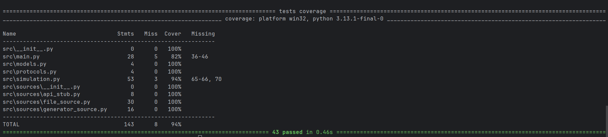

# Лабораторная работа №1. Источники задач и контракты

**Галанова Екатерина, М8О-102БВ-25**

## Описание

Подсистема приёма задач в платформе обработки задач. Задачи поступают из различных источников, не связанных наследованием, но реализующих единый поведенческий контракт через `typing.Protocol`. Проект демонстрирует принципы duck typing и контрактного программирования.

## Структура проекта

```
src/
  models.py              — модель задачи (NamedTuple с полями id и payload)
  protocols.py            — протокол TaskSource (@runtime_checkable)
  main.py                 — фабрика источников и обработка задач
  simulation.py           — интерактивная симуляция через меню
  sources/
    file_source.py        — загрузка задач из текстового файла
    generator_source.py   — программная генерация задач
    api_stub.py           — имитация внешнего API
  text_files/
    tasks.txt             — пример файла с задачами
tests/
  tests.py                — юнит-тесты (pytest)
```

## Модель задачи

Задача представлена как `NamedTuple` с двумя полями:

- `id` — уникальный строковый идентификатор задачи
- `payload` — произвольные данные задачи (тип `Any`)

## Контракт источников

Контракт описан с помощью `typing.Protocol` и декоратора `@runtime_checkable`:

```python
@runtime_checkable
class TaskSource(Protocol):
    def get_tasks(self) -> list[Task]: ...
```

Каждый источник задач обязан реализовать метод `get_tasks()`, возвращающий список объектов `Task`. Общий базовый класс не используется — источники связаны только контрактом.

Проверка соблюдения контракта выполняется в двух точках:

- `issubclass(source_class, TaskSource)` — при создании источника через фабрику `create_source`
- `isinstance(source, TaskSource)` — при обработке задач в `process_tasks`

## Почему Protocol + duck typing, а не базовый класс

В этой лабораторной источники задач независимы по реализации: один читает файл, другой генерирует данные, третий имитирует API. Им важно не общее происхождение, а единое поведение.

`Protocol` позволяет описать именно поведение: "источник обязан иметь `get_tasks() -> list[Task]`". Благодаря duck typing в систему можно добавить любой новый класс, который соблюдает этот контракт, без наследования от общего предка и без изменения существующих модулей.

Преимущества такого подхода в этом проекте:

- меньше связности между компонентами;
- проще расширять систему новыми источниками;
- код проверки контракта остаётся явным (`issubclass` и `isinstance`);
- соблюдается требование задания: не использовать общий базовый класс для источников.

## Источники задач

**FileSource** — читает задачи из текстового файла. Каждая строка содержит идентификатор и данные, разделённые символом `;`.

**GeneratorSource** — программно генерирует заданное количество задач с последовательными идентификаторами.

**ApiStubSource** — заглушка внешнего API, возвращающая фиксированный набор задач со словарями в качестве данных.

Для добавления нового источника достаточно создать класс с методом `get_tasks() -> list[Task]`. Изменение существующего кода не требуется.

## Запуск

Интерактивная симуляция:

```bash
python -m src.simulation
```

Запуск тестов:

```bash
python -m pytest tests/tests.py -v
```

Проверка покрытия:

```bash
python -m pytest --cov=src tests/tests.py --cov-report=term-missing
```

## Тестирование

Тесты покрывают все модули проекта:

- Создание и свойства модели `Task`
- Проверка протокола `TaskSource` через `issubclass` и `isinstance`
- Корректность работы каждого источника (`FileSource`, `GeneratorSource`, `ApiStubSource`)
- Фабрика `create_source` — создание валидных источников и отклонение невалидных
- Функция `process_tasks` — вывод задач и проверка контракта
- Интерактивная симуляция — все пункты меню

Покрытие кода составляет 94%.

