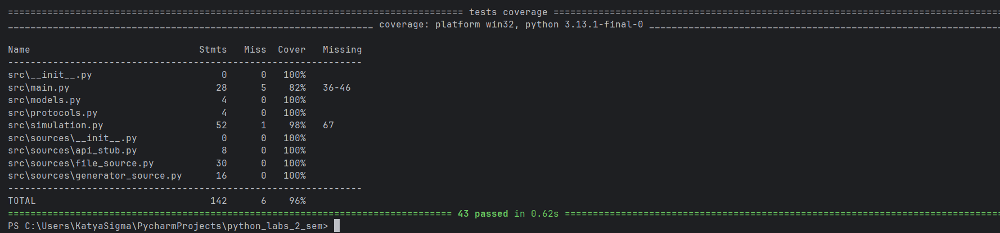

# Лабораторные работы 1–2. Платформа обработки задач

**Галанова Екатерина, М8О-102БВ-25**

## Структура проекта

```
src/
  models.py              — модель задачи Task, дескрипторы валидации
  exeptions.py           — специализированные исключения
  protocols.py           — протокол TaskSource
  main.py                — фабрика источников и обработка задач
  simulation.py          — интерактивная симуляция через меню
  sources/
    file_source.py       — загрузка задач из текстового файла
    generator_source.py  — программная генерация задач
    api_stub.py          — имитация внешнего API
  text_files/
    tasks.txt            — пример файла с задачами
tests/
  tests.py               — тесты к лабораторной 1
  tests_lab2.py          — тесты к лабораторной 2
```

---

## Лабораторная работа 1. Источники задач и контракты

Подсистема приёма задач. Задачи поступают из различных источников, не связанных наследованием, но реализующих единый контракт через `typing.Protocol`.

### Контракт источников

```python
@runtime_checkable
class TaskSource(Protocol):
    def get_tasks(self) -> list[Task]: ...
```

Каждый источник обязан реализовать `get_tasks()`. Общий базовый класс не используется — источники связаны только контрактом. Проверка выполняется через `issubclass` (при создании) и `isinstance` (при обработке).

### Источники задач

- **FileSource** — читает задачи из текстового файла (формат `id;payload`)
- **GeneratorSource** — генерирует заданное количество задач
- **ApiStubSource** — заглушка внешнего API

### Почему Protocol, а не базовый класс

Источники независимы по реализации. `Protocol` описывает поведение, а не происхождение — новый источник можно добавить без наследования и без изменения существующего кода.

---

## Лабораторная работа 2. Модель задачи: дескрипторы и @property

Модель `Task` с инкапсуляцией и валидацией состояния.

### Атрибуты задачи

| Атрибут | Тип | Описание |
|---|---|---|
| `id` | `str` | Уникальный идентификатор (непустая строка) |
| `description` | `str` | Описание задачи (непустая строка) |
| `priority` | `int` | Приоритет от 1 до 10 |
| `status` | `str` | `pending` / `in_progress` / `done` / `cancelled` |
| `payload` | `Any` | Произвольные данные |
| `created_at` | `datetime` | Время создания (read-only, `@property`) |
| `is_ready` | `bool` | Вычисляемое свойство: `pending` и приоритет >= 3 |

### Дескрипторы

- **`StringValidator`** — data-дескриптор, проверяет что значение — непустая строка. Используется для `id` и `description`.
- **`PriorityValidator`** — data-дескриптор, проверяет что приоритет — `int` от 1 до 10 (отсекает `bool` и `float`).
- **`StatusValidator`** — data-дескриптор, допускает только разрешённые статусы.
- **`ReadOnlyTimestamp`** — non-data дескриптор (только `__get__`, без `__set__`), демонстрирует отличие от data-дескрипторов.

### Исключения

Все наследуются от `TaskValidationError`:
- `InvalidPriorityError` — некорректный приоритет
- `InvalidStatusError` — недопустимый статус
- `InvalidTaskIdError`, `InvalidDescriptionError` — ошибки id/описания

---

## Запуск

Интерактивная симуляция:

```bash
python -m src.simulation
```

Тесты лабораторной 1:

```bash
python -m pytest tests/tests.py -v
```

Тесты лабораторной 2:

```bash
python -m pytest tests/tests_lab2.py -v
```
- Фабрика `create_source` — создание валидных источников и отклонение невалидных
- Функция `process_tasks` — вывод задач и проверка контракта
- Интерактивная симуляция — все пункты меню

Покрытие кода составляет 96%.

